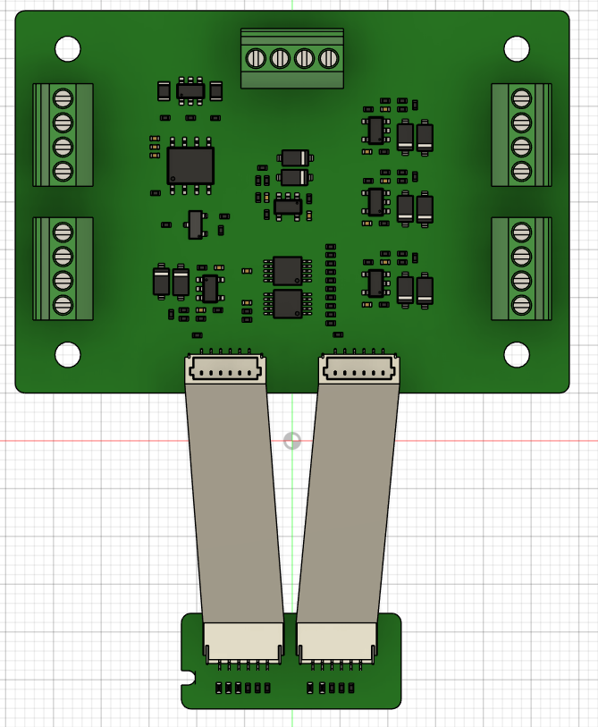
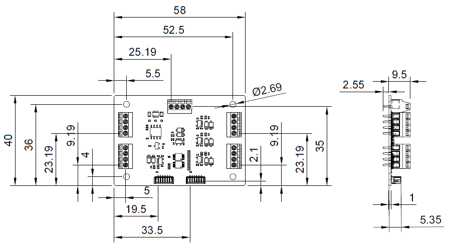

|  |  |  |    
| :-: | :-: | :-: |     

# ⚠️ BETA! ⚠️
This library is still in testing phase!

# Library for RAK13015 industrial interface module

This library is the interface to the different interfaces provides by the RAK13015 module.     
It supports the three 4-20mA interfaces, the two 0-30V analog interfaces and the RS485 interface.    

⚠️ This library supports the RS485 interface with simple ModBus RTU support. If the RS485 interface is used as plain serial connection or a different Modbus implementation is required, additional libraries might be required. ⚠️    

----

# Documentation

* **[RAK13015 Class Documentation](https://beegee-tokyo.github.io/RAK13015/)**
* **[RAK13015 schematics](../assets/RAK13015-VA-SCH.pdf)**
* **[RAK13016 schematics](../assets/RAK13016-VA-SCH.pdf)**
* **Cable connection between RAK13015 and RAK13016**
<center></center>    

* **Mechanic dimensions RAK13015**
<center></center>

----

# Installation

In Arduino IDE manual installation is required as the library is not submitted to the Library Manager.      
Download the library from [RAK13015](https://github.com/beegee-tokyo/RAK13015) as ZIP file. Unzip it and place the RUI3-Arduino-Library folder into the library directory.
In Arduino IDE this is usually <arduinosketchfolder>/libraries/

In PlatformIO install the library project dependencies by adding

```log
lib_deps =
  https://github.com/beegee-tokyo/RAK13015.git
```

into **`platformio.ini`**

----

# GPIO and SERIAL assignments
The GPIO's and Serial assignments depend on the used WisBlock Base Board and the Sensor Slot used. Some Sensor Slots are not suitable, because they either have no Serial connection or there is a conflict with the used IO's.    

**RAK19007**    
Slot A ==> NC (WB_IO2 not available)    
Slot B ==> NC (WB_IO2 not available)    
Slot C ==> NC    
Slot D ==> Serial 1 ALERT WB_IO6 TCON WB_IO5    

**RAK19003**    
Slot C ==> Serial 1 ALERT WB_IO4 TCON WB_IO3    
Slot D ==> Serial 1 ALERT WB_IO6 TCON WB_IO5     

**RAK19001**    
Slot A ==> NC (WB_IO2 not available)     
Slot B ==> NC (WB_IO2 not available)     
Slot C ==> NC    
Slot D ==> Serial 2 ALERT WB_IO6 TCON WB_IO5     
Slot E ==> Serial 2 ALERT WB_IO4 TCON WB_IO3    
Slot F ==> Serial 1 ALERT WB_IO5 TCON WB_IO6     

# Usage

